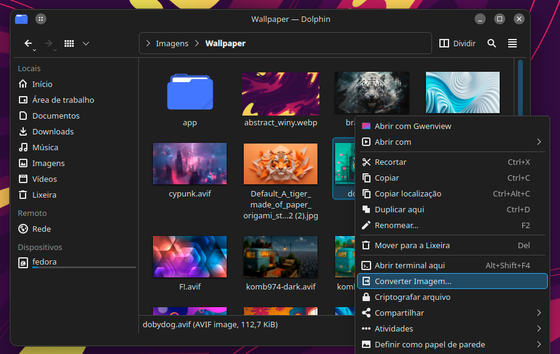
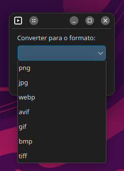
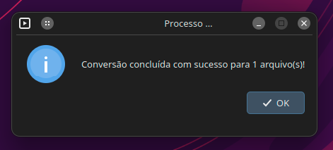

# Conversor de Imagens Universal - Menu de Serviço para Dolphin


Um poderoso Menu de Serviço para o gerenciador de arquivos Dolphin (KDE Plasma) que converte um ou múltiplos arquivos de imagem para qualquer formato popular com apenas alguns cliques.

## Sobre o Projeto

No fluxo de trabalho digital de hoje, lidamos com uma variedade crescente de formatos de imagem: JPEGs de câmeras, PNGs com transparência, e formatos modernos para a web como WebP e AVIF. A conversão entre esses tipos muitas vezes requer ferramentas diferentes ou processos online demorados.

Este projeto nasceu para simplificar e unificar essa tarefa. Integrado diretamente ao Dolphin, ele utiliza o poder do `ffmpeg` para oferecer uma solução de conversão universal, rápida e eficiente, diretamente no seu menu de contexto.

## Recursos

-   🔄 **Conversão Universal:** Converta de e para os formatos mais populares, incluindo `PNG`, `JPG`, `WebP`, `AVIF`, `GIF`, `BMP` e `TIFF`.
-   🗂️ **Suporte a Múltiplos Arquivos:** Selecione quantos arquivos de imagem desejar e converta todos de uma só vez.
-   🖥️ **Interface Gráfica Simples:** Uma caixa de diálogo nativa permite que você escolha facilmente o formato de saída desejado.
-   🚀 **Motor `ffmpeg`:** Utiliza o `ffmpeg`, uma das ferramentas de conversão de mídia mais poderosas e rápidas disponíveis.
-   ⚙️ **Instalação Inteligente:** O script de instalação verifica se a dependência `ffmpeg` está presente e orienta o usuário.
-   🗑️ **Remoção Limpa:** Acompanha um script `uninstall.sh` para uma desinstalação segura e completa.

## Demonstração

1.  **Acesso Rápido pelo Menu de Contexto:**
    

2.  **Seleção Simples do Formato de Saída:**
    
    
3.  **Confirmação da conclusão:**
    

## Pré-requisitos

Para que o script funcione, seu sistema precisa ter:

-   Um ambiente de trabalho **KDE Plasma** com o gerenciador de arquivos **Dolphin**.
-   O pacote `kdialog` (geralmente já vem instalado com o Plasma).
-   A dependência fundamental: **`ffmpeg`**.

**Importante:** O script de instalação irá verificar se o `ffmpeg` está instalado e irá parar a instalação com instruções caso ele esteja ausente.

## Instalação

1.  Baixe o arquivo `.tar.gz` do projeto e extraia-o.
2.  Abra um terminal e navegue para dentro da pasta extraída.
    ```bash
    cd nome-da-pasta-do-instalador
    ```
3.  Execute o script de instalação:
    ```bash
    bash install.sh
    ```
4.  Reinicie o Dolphin para que as alterações tenham efeito:
    ```bash
    dolphin -q && dolphin &
    ```

## Como Usar

1.  No Dolphin, selecione um ou mais arquivos de imagem.
2.  Clique com o botão direito nos arquivos selecionados.
3.  No menu de contexto, clique em **Converter Imagem...**.
4.  Na janela que aparecer, selecione o formato de destino na lista e clique em "OK".
5.  A conversão será realizada em segundo plano. Ao final, uma mensagem de sucesso será exibida. Os novos arquivos serão criados na mesma pasta dos originais.

## Desinstalação

1.  Navegue novamente até a pasta de instalação.
2.  Execute o script de desinstalação:
    ```bash
    bash uninstall.sh
    ```
3.  Reinicie o Dolphin para que o menu de serviço desapareça.

## Autor

-   **Ney Designer**

---

